# Lex

A Go-based MCP server providing a local-first Exa-like alternative (with Exa search support) and web scraping.

Unlike other search MCP servers that return only snippets and force a second `fetch` call, Lex embeds full-page content extraction directly into each search result via heuristic sentence re-ranking. No external API, no browser, no RAG pipeline.

## Features

- `One-shot search` — returns real page highlights, not just snippets
- `Dual-engine search` — Exa AI (MCP RPC) first, DuckDuckGo Lite fallback, first non-empty wins
- `Zero-overhead extraction` — no browser, no external API, no vector DB, no RAG
- `BM25 re-ranking` — page-level scoring with tiered highlight budgets (top half full, bottom half half)
- `Semantic fetch` — optional query re-ranks fetched content to the most relevant parts, preserving structure and order
- `Content-aware` — probes `<main>` / `<article>` / `[role=main]` containers by priority
- `Robust encoding` — automatic charset detection and garbled-text repair (GBK/Big5/Shift-JIS, etc.)
- `Office documents` — direct `.pdf` / `.docx` / `.xlsx` / `.xls` / `.pptx` to Markdown conversion
- `YouTube bypass` — detects video links, extracts transcripts and comments via oEmbed + yt-dlp
- `Built-in cache` — LRU 1024 entries / 5-minute TTL, repeated fetches cost nothing
- `Concurrent by design` — 8-way semaphore parallelism, graceful fallback to original snippets

## Install

```bash
go mod download
go build -o lex.exe .
```

## Usage

Register in your MCP client config:

```json
{
  "mcpServers": {
    "lex": {
      "command": "./lex.exe"
    }
  }
}
```

### `web_search`

```json
{ "query": "Go 1.24 Swiss Table map performance", "max_results": 10 }
```

- `query` — natural-language query describing what you want to find; works for both keyword sequences and full sentences
- `max_results` clamped to `[5, 50]`, defaults to 10
- Returns `Title` / `URL` / `Snippet` / `Highlights` in markdown
- Fetches all pages concurrently → BM25 page scoring → top half gets full highlight budget (3000 tokens), bottom half gets half

### `web_fetch`

```json
{ "urls": ["https://example.com/article"], "char": "16000", "query": "benchmark comparison" }
```

- `urls` — list of target URLs to fetch
- `char` — per-URL character budget as a number (clamped to `[2000, 64000]`, rounded to nearest 1000) or the trigger word `full` to return the entire page without reranking
- `query` — optional semantic focus; when provided, fetched content is re-ranked to keep the parts most relevant to this query, preserving structure and order (ignored when `char` is `full`)
- URLs fetched concurrently; failed items are annotated individually without breaking the batch

## How It Works

```mermaid
flowchart LR
  A["Exa MCP RPC / DDG Lite"] --> B["parse results"]
  B --> C["concurrent fetch (x8)"]
  C --> D["hook match: HTML / Office / YouTube"]
  D --> E["HTML-to-Markdown"]
  E --> F["content area extraction"]
  F --> G["charset detect + garbled repair"]
  G --> H["BM25 page scoring"]
  H --> I["tiered highlight budget"]
  I --> J["structured results"]
```



The BM25 engine layers identifier expansion (snake_case / camelCase splitting), stem matching, noise-sentence penalties, and code-block preservation — pure Go, zero ML.

## Tech Stack

- Go 1.25+
- `go-sdk/mcp` — MCP Go SDK (declarative tool registry, schema inferred from jsonschema tags)
- `goquery` — HTML parsing and content extraction
- `html-to-markdown` — HTML to Markdown conversion
- `markitdown` — Office document to Markdown conversion
- `golang-lru/v2` — expirable LRU cache
- `x/net/html/charset` — charset detection and decoding

## License

AGPL-3.0
