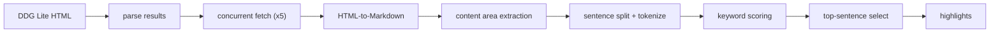

# Lex

A Go-based MCP server providing DuckDuckGo search and web scraping — a zero-overhead local Exa alternative.

Unlike other DDG MCP servers that return only snippets and force a second `fetch` call, `Lex` embeds full-page content extraction directly into each search result via heuristic sentence re-ranking. No external API, no browser, no RAG pipeline.

## Tools

- `search` — Search DuckDuckGo Lite, concurrently fetch each result page, extract query-relevant highlights, return structured markdown
- `fetch` — Fetch URL content via direct HTML-to-Markdown conversion with configurable character limits

## Why Lex

- `One-shot search` — returns real page highlights, not just snippets
- `Zero-overhead extraction` — no browser, no external API, no vector DB, no RAG
- `Content-aware` — auto-detects `<main>`, `<article>`, `[role=main]` and other containers
- `Concurrent by design` — up to 5 parallel fetches, 15s timeout, graceful snippet fallback

## Install

```bash
go mod download
go build -o lex.exe .
```

## Usage

Add to MCP client config:

```json
{
  "mcpServers": {
    "lex": {
      "command": "./lex.exe"
    }
  }
}
```

### `search`

```json
{ "query": "Go 1.24 Swiss Table map performance" }
```

Returns `Title`, `URL`, `Snippet`, and `Highlights` in markdown.

### `fetch`

```json
{ "urls": { "https://example.com/article": 16000 } }
```

Per-URL character limits clamped to `[2000, 64000]`, rounded to nearest 1000.

## How Highlights Work



Scoring formula: `hit_rate * 0.5 + hit_count_norm * 0.3 + position_bonus * 0.2`. ~100 lines of pure Go, zero ML.

## Tech

- Go 1.25+
- `go-sdk/mcp` — MCP Go SDK
- `goquery` — HTML parsing & content extraction
- `html-to-markdown` — HTML to Markdown conversion

## Implementation Details

- Uses DuckDuckGo Lite (`lite.duckduckgo.com`) — no API key, no rate limit worries
- `search` concurrently fetches each result page (concurrency: 5, timeout: 15s)
- Content area extraction via ordered selectors: `<main>` → `<article>` → `[role=main]` → `.post-content` → `.content` → `#content`
- Highlights budget: 4000 characters per page, whole-sentence boundaries
- Graceful degradation: failed page fetches fall back to original snippet
- `fetch` supports per-URL character limits, clamped to `[2000, 64000]`, rounded to nearest 1000

## License

AGPL-3.0
